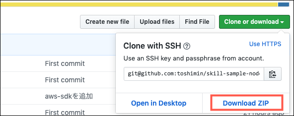
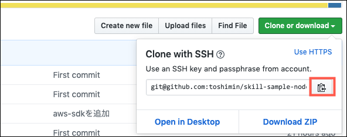
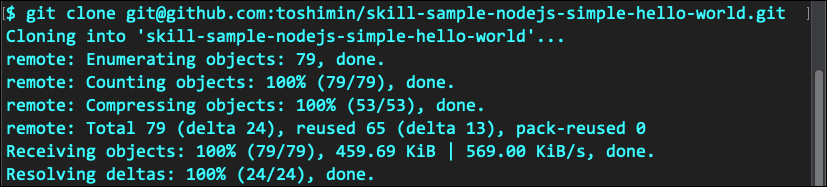
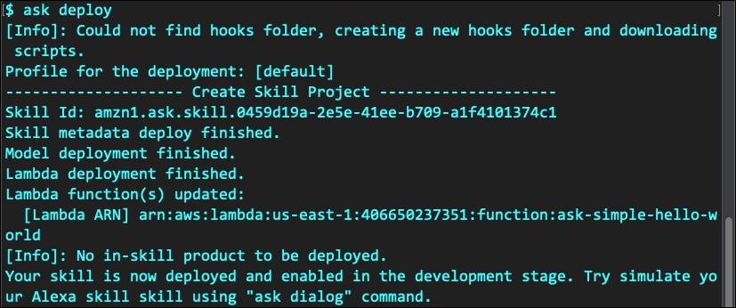
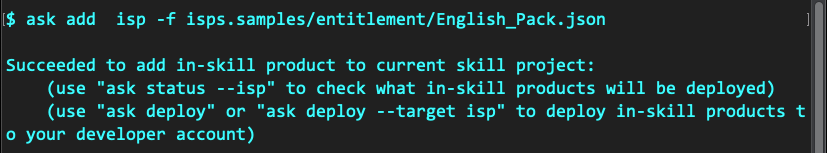
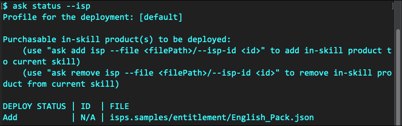
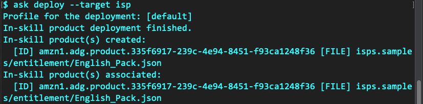
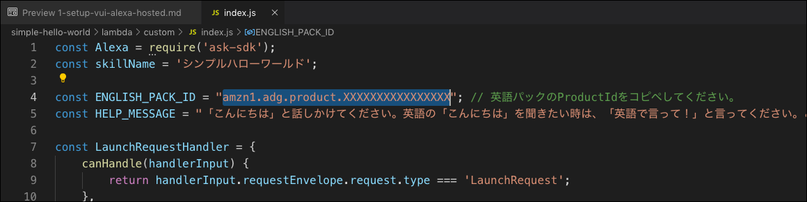
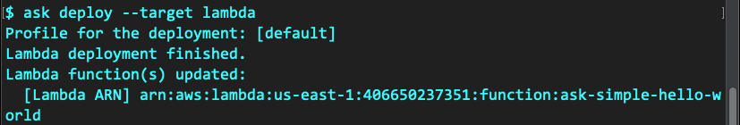

**[Alexaスキル内課金ワークショップ](../README.md)**

# 課題１ 「シンプルハローワールド」のセットアップ

## 方法2: ASK CLIを使ってセットアップする

ASK CLIを利用できる環境があれば、**方法１**よりももっと素早くサンプルスキルをデプロイすることができます。ASK CLIのセットアップ方法および利用方法については、以下のリソースを参照してください。

- [ASK CLI クイックスタート](https://developer.amazon.com/ja/docs/smapi/quick-start-alexa-skills-kit-command-line-interface.html)
- [ASK CLI コマンドリファレンス](https://developer.amazon.com/ja/docs/smapi/ask-cli-command-reference.html)


### セットアップ手順

1. OSのターミナルアプリケーションを起動します。

1. プロジェクトファイルをZIPでダウンロードするか、gitコマンドでクローンするかを選択します。それぞれの手順は以下の通り。

    -  **ZIPファイルをダウンロードする場合**
    
        1. 「Download ZIP」をクリックしてZIPファイルをローカルにダウンロードします。
            

        1. ダウンロードしたZIPファイルを任意のワーキングフォルダで解凍します。

        1. ローカルに skill-sample-nodejs-simple-hello-world フォルダができているはずです。

    - **git コマンドでクローンする場合**

        1. クローンするためのURLをコピーします。
            

        1. 任意のワーキングフォルダーに移動します。

            ```bash
            $ cd <working folder>
            ```
        
        1. プロジェクトファイルをクローンします。

            ```bash
            $ git clone git@github.com:<xxxxxxxx>/skill-sample-nodejs-simple-hello-world.git
            ```
            出力結果
            

        1. ローカルに skill-sample-nodejs-simple-hello-world フォルダができているはずです。

        1. カレントフォルダーを **skill-sample-nodejs-simple-hello-world** 内に移動します。

            ```bash
            $ cd skill-sample-nodejs-simple-hello-world
            ```

1. askコマンドでスキルをデプロイします。

    ```bash
    $ ask deploy
    ```
    出力結果
    

1. スキル内商品を登録します。すでに作成済みの「英語パック」のJSONコード(Engllish_Pack.json)があるので、これをデプロイします。

    > このJSON形式の商品ファイルは、以下のASK CLIコマンドを使って新規に作成することもできます。
    > `$ ask api create-isp -f <filename>`

1. スキル内商品ファイルを追加します。

    ```bash
    $ ask add isp -f isps.samples/entitlement/English_Pack.json 
    ```
    出力結果
    

1. 登録状況を確認します。

    ```bash
    $ ask status --isp
    ```

    出力結果
    

     > この時点では、ステータスが**ADD**です。まだスキルにはリンクされていません。

1. スキル内商品をデプロイします。

    ```bash
    $ ask deploy --target isp
    ```

    出力結果
    

    > スキル内商品が作成され(created)、リンクされた(Associated)ことがわかります。
    > [ID]と表記されているのが発行された「英語パック」の**商品ID**になります。

1. 「英語パックの」**商品ID**をコピーします。

1. お好みのコードエディタ(VS Codeなど）で **lambda/custom/index.js** ファイルを開きます。

1. 4行目の`"amzn1.adg.product.XXXXXXXXXXXXXXXX";`の部分に、**商品ID**を上書きペーストし保存します。

    

1. コードに変更を加えたので、再びLambdaコードをデプロイします。

    ```bash
    $ ask deploy --target lambda
    ```

    出力結果
    

    > Lambdaコードだけを再デプロイする場合は、`--target lambda` オプションが利用できます。同様に対話モデルのみに修正を加えた場合は、`--target model` オプションを利用することができます。これらのオプションを付けない場合は、対話モデルとLambdaの両方をデプロイし直します(注意；スキル内商品は再デプロイされません）。

    念のためAlexa開発者コンソールに戻り、シンプルハローワールドスキルができているか確認してください。


以上で、ASK CLIを使ったサンプルスキルのデプロイは完了し、テストできる状態になりました。

課題２へと進んでください。

:point_right: [課題2 スキルの動作確認とログの確認](2-test.md)


