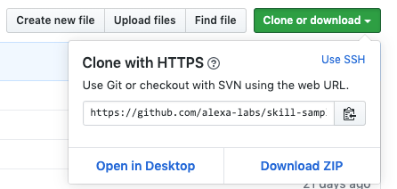
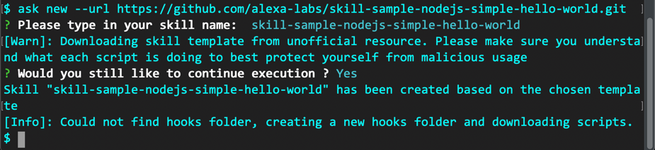

**[Alexa スキル内課金ワークショップ](../README.md)**

# 課題１ 「シンプルハローワールド」のセットアップ

## 方法 2: ASK CLI を使ってセットアップする

ASK CLI を利用できる環境があれば、**方法１**よりももっと素早くサンプルスキルをデプロイすることができます。ASK CLI のセットアップ方法および利用方法については、以下のリソースを参照してください。

-   [ASK CLI クイックスタート](https://developer.amazon.com/ja/docs/smapi/quick-start-alexa-skills-kit-command-line-interface.html)
-   [ASK CLI コマンドリファレンス](https://developer.amazon.com/ja/docs/smapi/ask-cli-command-reference.html)

### セットアップ手順

1. OS のターミナルアプリケーションを起動します。

1. クローンするための URL をコピーします（HTTPS の URL を選択してください）。
   

1. 任意のワーキングフォルダーに移動します。

    ```bash
    $ cd <working folder>
    ```

1. プロジェクトファイルをクローンします。

    ```bash
    $ ask new --url https://github.com:alexa-labs/skill-sample-nodejs-simple-hello-world.git
    ```

    出力結果
    

1. ローカルディクス上に skill-sample-nodejs-simple-hello-world フォルダーができているはずです。

1. カレントフォルダーを **skill-sample-nodejs-simple-hello-world** 内に移動します。

    ```bash
    $ cd skill-sample-nodejs-simple-hello-world
    ```

1. ask コマンドでスキルをデプロイします。

    ```bash
    $ ask deploy
    ```

    出力結果
    

1. スキル内商品を登録します。すでに作成済みの「英語パック」の JSON コード(Engllish_Pack.json)があるので、これをデプロイします。

    > この JSON 形式の商品ファイルは、以下の ASK CLI コマンドを使って新規に作成することもできます。
    > `$ ask api create-isp -f <filename>`

1. スキル内商品ファイルを追加します。

    ```bash
    $ ask add isp -f isps.samples/entitlement/English_Pack.json
    ```

    出力結果
    

1. 登録状況を確認します。

    ```bash
    $ ask status --isp
    ```

    出力結果
    

    > この時点では、ステータスが**ADD**です。まだスキルにはリンクされていません。

1. スキル内商品をデプロイします。

    ```bash
    $ ask deploy --target isp
    ```

    出力結果
    

    > スキル内商品が作成され(created)、リンクされた(Associated)ことがわかります。
    > [ID]と表記されているのが発行された「英語パック」の**商品 ID**になります。

1. 「英語パックの」**商品 ID**をコピーします。

1. お好みのコードエディタ(VS Code など）で **lambda/custom/index.js** ファイルを開きます。

1. 4 行目の`"amzn1.adg.product.XXXXXXXXXXXXXXXX";`の部分に、**商品 ID**を上書きペーストし保存します。

    

1. コードに変更を加えたので、再び Lambda コードをデプロイします。

    ```bash
    $ ask deploy --target lambda
    ```

    出力結果
    

    > Lambda コードだけを再デプロイする場合は、`--target lambda` オプションが利用できます。同様に対話モデルのみに修正を加えた場合は、`--target model` オプションを利用することができます。これらのオプションを付けない場合は、対話モデルと Lambda の両方をデプロイし直します(注意；スキル内商品は再デプロイされません）。

    念のため Alexa 開発者コンソールに戻り、シンプルハローワールドスキルができているか確認してください。

以上で、ASK CLI を使ったサンプルスキルのデプロイは完了し、テストできる状態になりました。

課題２へと進んでください。

:point_right: [課題 2 スキルの動作確認とログの確認](2-test.md)
