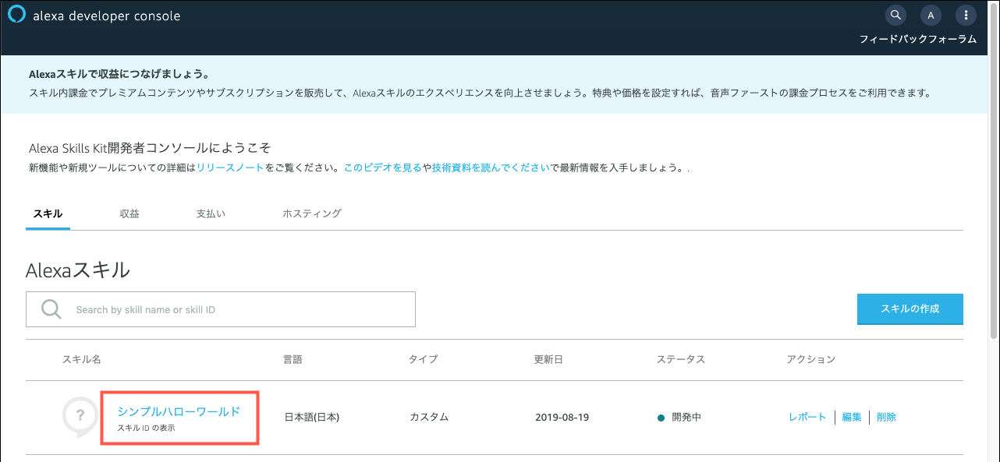

**[Alexaスキル内課金ワークショップ](../README.md)**

# 課題２ スキルの動作確認とログの確認


課題１でセットアップした「シンプルハローワールド」スキルをテストしながら動作を確認します。
動作の確認にはAlexaシミュレーターを使用します。

## 課題2-1 Alexaシミュレーターにアクセスする

1. [Alexa開発者ポータル](https://developer.amazon.com/edw/home.html#/skills/list)に戻り、課題1で作成したサンプルスキル「シンプルハローワールド」を開きます。

      

1. トップのナビゲーションメニューから **テスト** タブを選択し **Alexaシミュレータ**を表示します。

      

      > ブラウザによってはマイクへのアクセス許可を要求する場合があります。マイクを有効にすることを推奨しますが、テキスト入力によるテストも可能です。

1. 上部のナビゲーションメニューのすぐ下にあるドロップダウンから、**開発中** を選択して、テストを有効にします。テストが有効になると**開発中**と表示されます。

      

## 課題2-2 Alexaとスキルとの間でやり取りされているデータを確認する

1. **Alexaシミュレータ** を使って、スキルが期待どおりに起動するかをテストします。テキストボックスに文字を入力するか、マイクアイコンを押しながらパソコンのマイクに向かって話しかけてみてください。

      - **文字入力する場合**
      
        スキルの呼び出し名「シンプルハローワールド」に続き、スキルの起動フレーズ「を開いて」をタイプし、リターンキーを押します。
        ```
        シンプルハローワールドを開いて
        ```
        
      
        
	- **音声で入力する場合**
      
        テキストボックス横のマイクアイコンをクリックした状態で、スキルの **呼び出し名** に続き "を開いて" と発話してください。

        
      
    > スキルが起動しない場合、呼び出し名が正しいかどうか確認します。トップメニューの **ビルド** タブを選択し、左側パネルの **呼び出し名** セクションで、呼び出し名の設定を確認します。
      
1. スキルが起動したら、次のようなフレーズをテストしてみてください
        
      * こんにちは
      * (続けますか？の後に）はい、または、いいえ
      * 英語で言って
      * 英語パックを購入
      * 英語パックをキャンセルして
      * ヘルプ
      * ストップ
      * 終了して

      > スキルに紐づいている開発者アカウントを使用している限り、商品を購入しても課金されることはありません。スキル内課金のテストに関する詳細は、[スキル内課金のテストガイド](https://developer.amazon.com/docs/in-skill-purchase/isp-test-guide.html) を参照してください。

      > スキルで商品を購入する場合は、テストしているユーザーアカウントに「音声ショッピング」のパーミッションが必要です。 さらに、スキル内商品の購入は、スキルの設定と同一の地域でのみ購入することができます。日本では amazon.co.jp のアカウントで登録されたデバイスから利用することができます。また、請求先住所も同じように国内に設定されている必要があります。これらの条件に不足があった場合は、購入時にエラーが発生します。

      > 買い切り型商品はキャンセルできません。お客様はアマゾンのカスタマーサービスに連絡する必要があります。開発中の場合は、テスト購入をリセットすることができます。

      > Alexaシミュレータで、「**終了**」とタイプするか、マイクで入力することにより、それぞれのテストパスを開始する前にセッションを正しくリセットすることができます。Alexaシミュレータは、テストをしやすくするために、通常のAlexa搭載デバイスよりも長い時間セッションを開き続けます。「**終了**」 と発話することで、明示的に確実にセッションを閉じることができます。

1. スキルの動作を確認する。

      1. **Alexaとスキルの間のデータのやり取りを確認する**

	      Alexaシミュレータの、スキルI/O パネルの **JSON入力** と **JSON出力** ボックスの内容を常に意識して確認してください。
            
            **JSON入力**は、Alexaからスキルに送信されたリクエストデータが表示されます。スキルに送信されたリクエストタイプやインテントの内容を確認することができます。

            **JSON出力**は、スキルからAlexaに送信されたレスポンスデータが表示されます。Alexaに話させるSSMLのデータや、購入フローに移る際にディレクティブに送信するデータを確認することができます。

            - 「英語で言って」と話しかけた場合のJSON出力では、何を送信していますか？
            - 上記のあと「詳しく聞きたいですか？」と質問されます。ここで「はい」と答え他場合の、JSON入力、およびJSON出力はどうなっていますか？
            - さらに、「同意して、購入しますか？」のあと、「はい」と答えた場合の、JSON入力のリクエストタイプは何が来ていますか？ 

            

            > Alexaの購入フローに遷移すると、一時的にスキルのセッションが終了します。この間はスキルではなく、Alexaが自動で応答を返します。つまりAlexaとスキルとの間の通信は行われないため、**JSON入出力は共に空白の状態**になります。購入フローが終了すると**Connections.Response**というタイプのリクエストがスキルに送信され、スキルのセッションが再開します。

      2. **スキル内商品のデータを確認する**
            
            スキルのコードでは、ユーザーが購入可能な商品は何か？ユーザーはどの商品を購入しているのか？などの情報を得るために、スキル内課金APIを使って頻繁にAlexaに問い合わせています。このデータは、スキルI/Oの画面には直接表示されないため、`console.log()`を使ってAWSのCloudWatchLogを通じてログとして書き出すようコード内に埋め込まれています。

            このログ出力データを確認してみましょう。

            **Alexa Hosted-Skillを使ってデプロイした場合**

            1. コードエディタの画面を開き、左下の「ログ: Amazon CloudWatch」をクリックします。

                  

                > 下の「**ここから共通**」までスキップしてください。

            **ASL CLIを使ってデプロイした場合**

            1. AWS管理コンソールにアクセスし、Lambdaサービスを開きます。関数の一覧からデプロイしたLambda関数を探し、クリックします。

                

               > この時、デプロイ先のリージョンが正しいか確認してください。特に指定がない場合は、デフォルトの**バージニア北部**にデプロイされます。

            1. **ask-simple-hello-world**の関数が開きます。「モニタリング」のタブをクリックします。

                
            
            1. CloudWatchメトリクスの画面が開きます。右側の「CloudWatchのログを表示」をクリックします。

                


            **ここから共通**      

            1. CloudWatchに記録されているログの一覧が表示されます。最終のイベント時刻列をみて、最新のログを確認しクリックします。(デフォルトでは一番上が最新になります)

                

            1. 検索フィルターで「PRODUCT」という文字が含まれるログを検索します。何軒かヒットしたら、そのうちの一つをクリックして開きます。下図のように、スキルからAlexaに問い合わせて入手した商品の詳細データ(JSON)を見ることができます。

                

               > このJSONデータの詳細については[「スキル内商品サービスAPIの使用」](https://developer.amazon.com/ja/docs/in-skill-purchase/in-skill-product-service.html#type-schemas)を参照してください。

      1. テスト購入した商品をリセットする
            
            Alexa 開発者コンソールのスキル内商品のページから、テスト購入をリセットすることができます。音声によるキャンセル処理がまだ実装されていない場合や、デバッグの際に利用することができます。
            
            該当商品を選び **テスト購入をリセット** をクリックするとテスト購入をリセットすることができます。 
            
            
            
            > スキル内商品が開発者コンソールから登録されたか ASK CLI で登録されたからに関わらずテスト購入をリセットすることができます。

            **ASK CLIでテスト購入をリセットする**

            ASK CLIでスキル内商品のテスト購入をリセットすることも可能です。以下のコマンドを利用してください。

            ```bash
            $ ask api reset-isp-entitlement -i <isp-id>
            ```


以上で、課題２は終了です。サンプルスキルの動作の確認ができました。

課題３へ進んでください。

:point_right: [課題3 **WhatCanIBuyIntentHandler**の実装](3-adding-WhatCanIBuyIntent-handler.md)