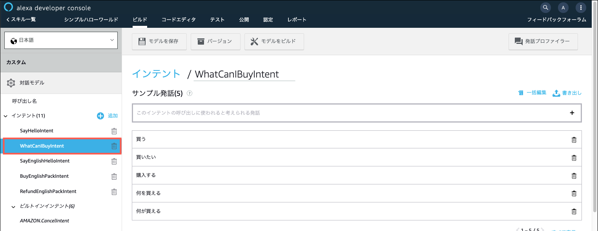
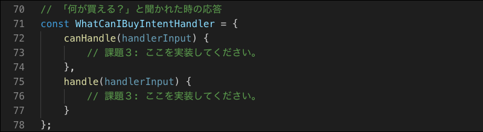
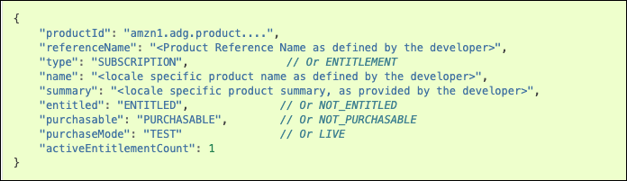

**[Alexaスキル内課金ワークショップ](../README.md)**

# 課題3 **WhatCanIBuyIntentHandler**の実装


この課題では、ASK SDKのスキル内課金APIを呼び出す**MonetizationServiceClient**を使って、Lambdaのコードにインテントハンドラーを一つ追加します。

この課題をクリアすると、ASK SDK の**MonetizationServiceClient**を使ってスキル内課金APIを呼び出す方法と、そのレスポンスの取り扱い方法をマスターすることができます。

## 課題の手順

1. Alexa開発者コンソールで、シンプルハローワールドスキルを開きます。

1. 左側のナビゲーションから、**WhatCanIBuyIntent**インテントをクリックします。既にいくつかのサンプル発話が入力されています。

    

    このインテントは、ユーザーがこのスキルを使ってどんな商品を購入できるのかを知りたい場合に、その情報を提供するためのインテントです。

    > このインテントには「買う」「買いたい」という発話も含まれていることに気づきましたか？これは、ユーザーが**何を**買いたいのか明示的に指示していないため、**購入できる商品をお知らせする**という意図で、このインテントに含んでいます。

    > ASK CLIを使ってデプロイしている場合は、[`models/ja-JP.json`](./models/ja-JP.json)ファイルを確認してください。

1. バックエンドのLambdaのコード[`index.js`](./lambda/custom/index.js)を確認します。このコードには**WhatCanIBuyIntent**を処理するためのインテントリクエストハンドラー`WhatCanIBuyIntentHandler` が正しく定義されていません。これを正しく実装します。

    index.jsの70行目あたり。

    

    コメント行「課題３: ここを実装してください」の部分に、処理コードを記述します。

    **コードを書くためのヒント**

     1. **WhatCanIBuyIntentHandler**では、Alexaのスキル課金APIを使って、スキルにリンクされているスキル内商品の情報を取得し、購入可能な商品があればその名前を含めて、さらに詳しい情報を知りたいかどうかをユーザーに尋ねます。既に購入済みなど、購入可能な商品が無ければ、このまま続けるかどうかを尋ねます。

        - 購入できる商品がある場合の応答
            ```
            現在、購入できる商品は {商品名} です。詳しく知りたい場合は、「{商品名}について教えて」と言ってください。このまま続ける場合は「こんにちは」と言ってください。どうしますか？
            ```
        - 購入できる商品がない場合の応答
            ```
            現在、購入できる商品はありません。続けますか？
            ```

     1. スキルにリンクされている単一のスキル内商品の情報を取得するには、`MonetizationServiceClient`の[`getInSkillProduct()`](https://ask-sdk-for-nodejs.readthedocs.io/ja/latest/Calling-Alexa-Service-APIs.html#getinskillproduct)メソッドを利用します。

        
        ```JavaScript
        getInSkillProduct(locale : string, productId : string) : Promise<services.monetization.InSkillProduct>
        ```
        具体的な記述方法は、こちらの[ドキュメント](https://ask-sdk-for-nodejs.readthedocs.io/ja/latest/Calling-Alexa-Service-APIs.html#getinskillproduct)を参照してください。
    
        > 複数のスキル内商品が登録されている場合、それらの情報を一度に取得するためのメソッド [`getInSkillProducts()`](https://ask-sdk-for-nodejs.readthedocs.io/ja/latest/Calling-Alexa-Service-APIs.html#getinskillproducts)も用意されています。どちらを使用しても構いません。

    1. `getInSkillProduct()`APIは、以下のような商品レコードを取得します。

        

        このJSONスキーマの詳細は、 [「商品IDでスキル内商品を取得する」](https://developer.amazon.com/ja/docs/in-skill-purchase/in-skill-product-service.html#request)を参照してください。

    1. **WhatCanIBuyIntentHandler**の`canHandle()`メソッドを実装します。

        このハンドラーが処理すべきリクエストのタイプは `IntentRequest`、インテント名は `WhatCanIBuyIntent` です。リクエストがこれらの条件にマッチする場合は**true**をリターンします。

    1. **WhatCanIBuyIntentHandler**の`handle()`メソッドを実装します。

        `handle()`メソッドに記述する応答文は、商品の名前(**name**)、ユーザーがその商品を購入済みかどうか(**entitled**)、商品が購入可能な状態かどうか(**purchasable**)のフィールドを利用して応答メッセージを作成します。

        **購入できる商品がある場合**の判別条件は以下のようになります。（未購入 かつ 商品が購入できる状態）
        ```
        (entitle === NOT_ENTITLED && purchasable === PURCHASABLE)
        ```

        **購入できる商品がない場合**の判別条件は以下のようになります。（既に購入済み または 商品が購入できない状態）
        ```
        (entitle === ENTITLED || purchasable === NOT_PURCHASABLE)
        ```

    1. 以上のヒントを元に、**WhatCanIBuyIntentHandler**を完成させてください。コードが完成したらAlexaシミュレーターで動作テストを行ってください。

以上で、課題３は完了です。ASK SDKが提供する**MonetizationServiceClient**の使用方法をマスターできましたか？

課題４へと進んでください。

:point_right: [課題4 サブスクリプション商品の追加](4-adding-subscription-product.md)


